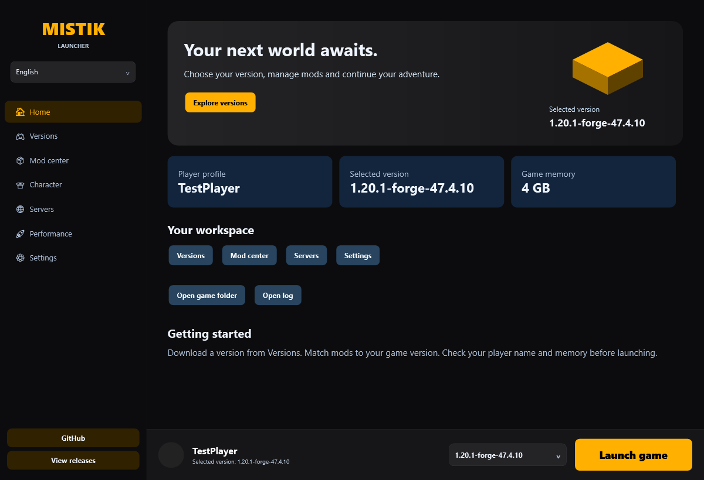
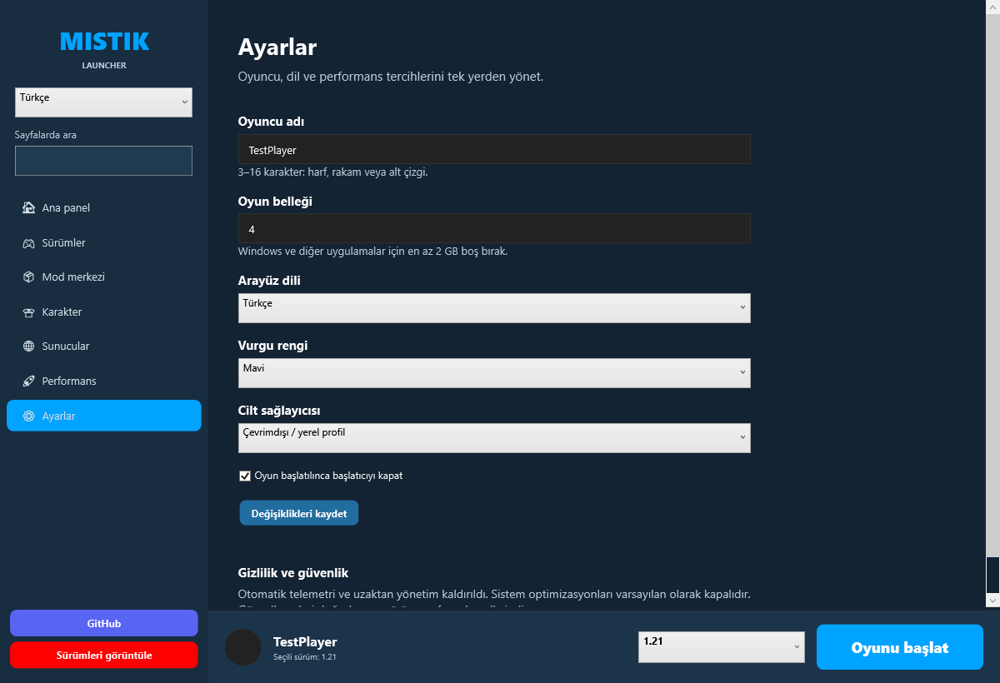
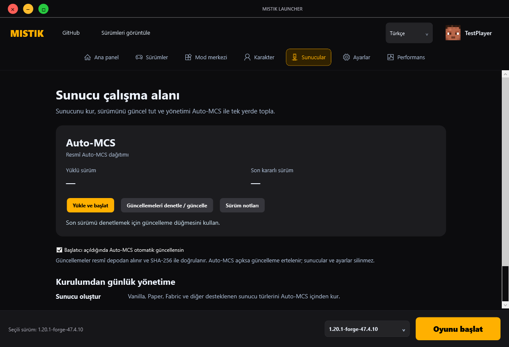
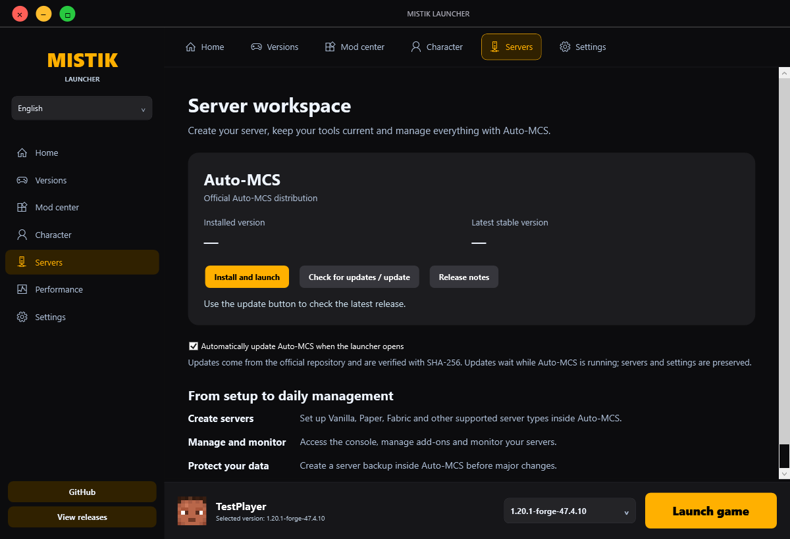

# Mistik Launcher Ultra 6.0.9 — Stable release / Kararlı sürüm

**Stable release.** Home, settings, navigation, diagnostics and launcher controls are bilingual. Vanilla/Forge profile management, automatic updates, installer rollback, crash reporting and the protected package were validated on Windows.

**Kararlı sürüm.** Ana panel, ayarlar, gezinme, tanılama ve launcher kontrolleri iki dillidir. Vanilla/Forge profil yönetimi, otomatik güncelleme, kurulum geri alma, hata raporlama ve korumalı paket Windows üzerinde doğrulandı.

### Güncel sürüm / Current version — 6.0.9

Güncelleme yardımcısı eski kurulum kayıtlarının yol biçimini güvenle onarır. Mod senkronizasyonu ve güncelleme indirmesi UI’yi bloklamaz. Güncelleme kartı hız, indirilen boyut ve tahmini kalan süreyi gösterir. Korumalı doğrulama: 260 kontrol. / The updater safely repairs legacy installation-record path formats. Mod synchronization and update downloads no longer block the UI. The update card shows speed, downloaded size and estimated time remaining. Protected validation: 260 checks.

[6.0.9 ayrıntıları / Details](docs/RELEASE-6.0.9.md). [6.0.9 indir / Download](https://github.com/gamer3434/MistikLauncherUltra/releases/tag/v6.0.9). Online: `MistikSetup-Online-6.0.9.exe`; offline: `MistikSetup-Offline-6.0.9.exe`; portable: `MistikLauncher-6.0.9-win-x64.zip`. SignPath incelemesi sürüyor; sürüm şu anda imzasızdır / SignPath review is pending; this release is currently unsigned.

### Önceki sürüm / Previous version — 6.0.1

Güncelleme etiket karşılaştırması, kurulumun hata sonrası geri alınması ve güncellenen dosyaların kaldırma kayıtları düzeltildi. / Fixed update version comparison, installation rollback and uninstall ownership after updates. [6.0.1 ayrıntıları / Details](docs/RELEASE-6.0.1.md).

Çıkış düğmesi artık 38×24 ölçülerinde, köşeleri yuvarlatılmış dikdörtgendir. Simetrik vektör çarpı tam ortalanır. **Tema**, **RGB · renk geçişi**, **Kapalı** seçenekleri korunur; RGB yalnızca çıkış çerçevesi ve ışığında yumuşak geçiş yapar. Bulut hesabı arayüzü ve otomatik profil eşitlemesi kaldırılmıştır; eski bulut kayıtları silinmez.

The close control now uses a 38×24 rounded rectangle and a precisely centered symmetric vector cross. **Theme**, **RGB · color cycle**, **Off** remain available; only close gets animated outline/glow. Cloud account UI and automatic profile synchronization remain removed; old cloud records are preserved.

Minecraft startup failure/nonzero exit restores the launcher and displays diagnostics. / Minecraft açılış hatası veya sıfırdan farklı çıkış kodu launcher'ı geri açar ve hata analizini gösterir. Real Vanilla/Forge gameplay results and previous remaining issues: [PC report](docs/PC-TESTS-PREVIEW-7.md).

**Download / İndir:** [6.0.1 release](https://github.com/gamer3434/MistikLauncherUltra/releases/tag/v6.0.1).

- `MistikSetup-Online-6.0.1.exe`: uygulama paketini GitHub'dan indirir ve SHA-256 doğrular / downloads and verifies this version's package from GitHub.
- `MistikSetup-Offline-6.0.1.exe`: uygulama dosyaları içinde bulunur; kurulum için internet gerekmez / embeds the full application; installation needs no internet.
- `MistikLauncher-6.0.1-win-x64.zip`: taşınabilir seçenek / portable option.

Kurulum dili sihirbazın sağ üstünden seçilir. Varsayılan konum `%LOCALAPPDATA%\Programs\MistikLauncherUltra`; yönetici izni gerekmez. Windows uygulama listesinden kaldırılabilir. Ayarlar, modlar ve dünyalar `%APPDATA%\.mistik_ultra` altında korunur. Dolu klasöre kurulum engellenir; mevcut kurulumu uygulamanın güncelleyicisiyle güncelleyin veya önce kaldırın. Launcher için yeni sürümleri otomatik alma ayarı ayrıca kullanılabilir.

Choose installer language at the upper right. Default per-user folder: `%LOCALAPPDATA%\Programs\MistikLauncherUltra`; no administrator rights needed. Uninstall through Windows installed apps. Existing settings, mods and worlds under `%APPDATA%\.mistik_ultra` are preserved. Nonempty destinations are rejected; use the launcher's updater or uninstall first. The launcher separately offers automatic updates for future versions.

**İmza / Signing:** Güncel 6.0.1 paketi imzasızdır; Authenticode veya genel Windows yayıncı güveni sağlamaz. İsteğe bağlı yerel test imzası yalnızca maintainer build adımında kullanılabilir. / The current 6.0.1 package is unsigned; it carries no Authenticode signature or public Windows publisher trust. Optional local test signing is maintainer-only.

**218 checks passed** on the protected package, including centered RGB controls in both languages, update metadata, installer rollback/retry, ownership/corruption/cancellation/lock tests. / Korumalı pakette **218 kontrol geçti**; iki dilde ortalı RGB düğmesi, güncelleme kayıtları ve başarısız kurulumdan sonra tekrar deneme doğrulandı. [Release details / Yayın ayrıntıları](docs/RELEASE-6.0.1.md). [Current window controls / Güncel pencere kontrolleri](docs/WINDOW-AND-TOOLBAR.md).

[Kurulum kılavuzu ve görseller / Setup guide and previews](docs/SETUP-PREVIEW-9.md).

[İmza durumu ve ücretsiz genel imza başvuru seçeneği / Signing status and free trusted signing application option](docs/CODE-SIGNING.md).

Maintainer-only signing / Yalnızca maintainer imzalama: `./scripts/Build-Protected.ps1 -SigningThumbprint YOUR_CERTIFICATE_THUMBPRINT` ardından `./scripts/Build-Installers.ps1 -SigningThumbprint YOUR_CERTIFICATE_THUMBPRINT`. `-AllowLocalTestSignature` yalnızca mevcut kullanıcı deposundaki açıkça güvenilir olmayan test sertifikası için kullanılabilir; özel anahtar pakete kopyalanmaz. İmzasız build eski signing metadata'sını taşımaz. / Use signing only in a maintainer-controlled build; public trust requires a separately verified publisher certificate.

## Türkçe

Yeni ana panel oyuncu profili, sürüm, bellek ve hızlı işlemleri gösterir. Ayarlarda oyuncu adı, 1–32 GB bellek, skin sağlayıcısı, renk ve otomatik kapanma seçilir. Üst menüdeki dil listesi anında Türkçe / English geçişi sağlar. Global launcher araması kaldırıldı; gezinme üstte, oyuncu adı ve skin yüzü sağ üsttedir. RedX referansındaki kömür siyahı yüzeyler, 20 renk seçeneği, Segoe UI ve görünür klavye odağı kullanılır.

Ayarlar atomik kaydedilir; önceki değerler `.bak` dosyasından kurtarılır. Donanım/IP telemetrisi ve kimlik doğrulamasız Firebase uzaktan yönetimi kaldırıldı. Sabit yönetici şifreleri ve eski kontrolsüz EXE değiştirme devre dışı bırakıldı; resmî doğrulanmış paket güncellemeleri yeni sistemle uygulanır. Açılışta sessiz kurulum, diğer başlatıcı işlemlerini sonlandırma ve otomatik sistem müdahaleleri kaldırıldı. MQTT için TLS yapılandırıldı; başlangıçta otomatik bağlantı kaldırıldı. Topluluk aktarımının güvenlik/kullanılabilirlik incelemesi sürüyor.

### Çalıştırma

Windows x64 için yayın sayfasından online veya yerel kurulumu seçin; taşınabilir kullanım için ZIP'i ayrı klasöre çıkartıp `MistikLauncher.exe` dosyasını açın. Paket kendi .NET çalışma zamanını içerir. **Paketin tüm dosyalarını bir arada tutun.** Yeni bağımsız kurulum kendi dosya kaydını yönetir; eski uygulama içi kurulum/kaldırma ve sertifika güven deposu değişiklikleri kapalıdır. Veriler `%APPDATA%\.mistik_ultra` içinde kalır.

1. Sağ üstte Türkçe veya English seçin.
2. Ayarlar sayfasında oyuncu adını ve belleği girip Değişiklikleri kaydet düğmesine basın.
3. Sürümler sayfasından oyun sürümünü indirin, alt çubukta seçin.
4. Uyumlu modları seçip Oyunu başlat düğmesini kullanın.

Vanilla/Forge dünya testi ve ayrı yerel sunucu doğrulandı. Her mod kombinasyonu, Microsoft/Ely.by girişi ve genel tüneller test edilmedi; Auto-MCS sunucu oluşturma sihirbazı hata verdi. Microsoft hesabı kimlik doğrulaması eklenmedi. Minecraft ve mod lisanslarına uyun.

### Derleme ve doğrulama

Windows ve .NET 8 SDK gerekir:

```powershell
dotnet build MistikLauncher/MistikLauncher.csproj -c Release
dotnet run --project Validation -c Release -- artifacts/screenshots-ordinary
./scripts/Build-Protected.ps1
```

Koruma betiği sabit sürümlü aracı yükler, taşınabilir sürümü derler, korumalı DLL ile doğrulamayı çalıştırır ve ZIP üretir. Özel eşleme ve PDB dosyaları pakete eklenmez. `checksums.json` bozulma tespiti içindir; dijital imza değildir.

## English

The redesigned home shows player, version, memory and quick actions. Settings validate player names and 1–32 GB RAM, and offer skin provider, accent and automatic closing. The top-right Turkish / English selector updates at runtime. Navigation is centered at the top, with player name and skin face at the right. Global launcher search has been removed; page-local mod and skin search remains. Charcoal surfaces, 20 accent palettes, Segoe UI typography and visible keyboard focus follow the supplied RedX references.

Configuration writes are atomic with recovery from the previous backup. Hardware/IP telemetry and unauthenticated Firebase administration were removed. Hardcoded administrator access and legacy arbitrary executable replacement are disabled; verified official package updates now use the new updater. Startup no longer silently installs, terminates other launcher processes or changes system preferences. MQTT uses TLS; automatic startup connection was removed. Community relay security/usability review remains outstanding.

### Run

Extract `artifacts/MistikLauncher-6.0.0-preview.9-win-x64.zip` to a dedicated Windows x64 folder and run `MistikLauncher.exe`, or choose an online/offline setup from the release. The .NET runtime is included. **Keep all package files together.** Legacy in-launcher installation/uninstallation and certificate trust changes remain disabled; the new standalone installer manages its own ownership record. Data remains under `%APPDATA%\.mistik_ultra`.

1. Select Türkçe or English at the top right.
2. Enter player name and RAM in Settings, then Save changes.
3. Download a version under Versions and select it in the bottom bar.
4. Choose compatible mods and select Launch game.

Vanilla/Forge gameplay and an isolated local server were verified. Every mod combination, Microsoft/Ely.by login and public tunnels remain untested; the third-party Auto-MCS server wizard failed. Microsoft account authentication was not added. Respect Minecraft and mod licenses.

### Build

Use the three commands above with .NET 8 SDK on Windows. The protection script restores Obfuscar 2.2.49, publishes a self-contained portable build, validates the protected DLL and packages it. Private obfuscation maps and debug symbols are excluded.

## Language resources / Dil kaynakları

Embedded `MistikLauncher/Locales/tr.json` and `en.json` share identical keys. `Localization.T("play")` returns **Oyunu başlat** / **Launch game**. New pages respond immediately to language events. Catalogued legacy strings are updated without recreating running server controllers. Full legacy-page translation remains incomplete.

Gömülü kaynakların anahtarları aynıdır. Yeni sayfalar dil değişikliğine anında yanıt verir; eski sayfaların tam çevirisi sürüyor. Eksik metinler [envanterde](docs/localization-remaining.txt) listelenir.

## Protection limits / Koruma sınırları

Eligible private member names and string constants are obfuscated. WPF entry points and JSON names are preserved. String hiding is reversible; it is not strong encryption and cannot secure embedded secrets. Public source remains readable. This preview is not Authenticode signed; SmartScreen and antivirus behavior cannot be guaranteed.

Özel üyeler ve metin sabitleri gizlenir; WPF/JSON adları korunur. Gizleme geri çevrilebilir; güçlü şifreleme değildir. Açık kaynak okunabilir kalır. Bu önizleme Authenticode imzası taşımaz; antivirüs veya SmartScreen garantisi yoktur.

## Screenshots / Ekran görüntüleri

Real off-screen WPF renders, not a running Minecraft session. / Gerçek WPF görüntüleri; açık Minecraft oturumu değildir.




## Files / Dosyalar

| File | Purpose / Amaç |
|---|---|
| `MistikLauncher/Core.cs` | Config recovery, normalization, telemetry removal, TLS / Ayarlar ve güvenlik |
| `MistikLauncher/App.xaml.cs` | Portable startup / Taşınabilir açılış |
| `MistikLauncher/MainWindow.xaml` | Top navigation, player profile, language, focus / Üst menü ve profil |
| `MistikLauncher/MainWindow.xaml.cs` | Runtime switching and navigation / Dil değiştirme |
| `MistikLauncher/Pages/ModernPages.cs` | Bilingual home and settings / İki dilli sayfalar |
| `MistikLauncher/Localization.cs` | Embedded resource loader / Dil kaynakları |
| `MistikLauncher/ReleaseSecurity.cs` | Update and uninstall safeguards / Güvenlik |
| `scripts/Build-Protected.ps1` | Protected package / Korumalı paket |
| `Validation/Program.cs` | Ordinary/protected checks and WPF renders / Normal-korumalı denetimler |
| `.github/workflows/validate.yml` | Windows CI / Windows doğrulama |

See [audit and outstanding work](docs/AUDIT.md). / [Denetim ve kalan işler](docs/AUDIT.md).

## Auto-MCS güncellemeleri / Auto-MCS updates

Sunucular sayfasındaki **Güncellemeleri denetle / güncelle** düğmesi resmî `macarooni-man/auto-mcs` deposunun son kararlı Windows ZIP paketini bulur. Eski sabit v5.3.0 bağlantısı kaldırıldı. Paket SHA-256 ve uzunluk ile doğrulanır, geçici klasörde hazırlanır ve EXE atomik değiştirilir. Önceki EXE `.bak` olarak korunur; oyun/sunucu ayarlarına dokunulmaz.

**Açılışta otomatik güncelleme** varsayılan olarak açıktır; Sunucular sayfasından kapatılabilir. Yüklü Auto-MCS başlatıcı açıldığında arka planda güncellenir. İlk kurulum kullanıcı düğmesiyle başlar. Açık Auto-MCS için güncelleme ertelenir; internet veya doğrulama hatası eski kurulumu korur. Güncel ve doğrulanmış sürüm tekrar indirilmez. Sunucu sayfasına girince uygulama otomatik açılmaz.

The **Check for updates / update** button selects the latest stable official Windows ZIP instead of the fixed mirrored release. Package size and official SHA-256 are verified before atomic EXE replacement, with the previous binary retained as `.bak`. Automatic startup updates are enabled by default and configurable on Servers. First installation requires the install button. Running Auto-MCS defers replacement; offline/digest failures preserve the old executable. Existing server data is left untouched.

The server page now displays installed/latest versions, progress, actionable status and release notes in Turkish and English. Ordinary/protected validation includes updater fixtures; an optional live check successfully downloaded and verified official v2.3.9 without executing it.

```powershell
dotnet run --project Validation -c Release -- artifacts/screenshots --live-mcs
```




## Otomatik launcher güncellemesi / Automatic launcher updates

**Ayarlar → Launcher güncellemeleri** bölümünde otomatik güncelleme varsayılan olarak açıktır. Başlatıcı açılışta ve açık kaldığı sürece her 30 dakikada resmî GitHub deposunun son **kararlı Release** sürümünü denetler. Daha yeni sürüm varsa Windows x64 ZIP paketinin resmî SHA-256 değeri, boyutu ve iç dosya manifesti doğrulanır. İndirme/ayar düzenleme gibi açık bir işlem sürüyorsa güncelleme ertelenir. Launcher güncelleme yardımcısı hazır olunca kapanır; yardımcı dosyaları yedekleyip değiştirir ve launcher'ı yeniden açar. Oyun dünyaları, ayarlar ve Auto-MCS kurulumuna dokunulmaz. Dosya değiştirme hatasında değiştirilen dosyalar geri alınır; yedekler geçici güncelleme klasöründe korunur.

**Bu paketi bir kez çıkartıp yeni EXE'yi açmanız gerekir.** Eski launcher sürümlerinde yeni yardımcı program bulunmaz. Kaynak kod commitleri otomatik güncelleme tetiklemez; yeni Windows ZIP içeren bir GitHub Release gerekir. Önizleme/prerelease ve eski sürümler otomatik yüklenmez.

Automatic updates are enabled under **Settings → Launcher updates**. The official latest stable GitHub Release is checked at startup and every 30 minutes. Newer Windows ZIPs are verified against the official SHA-256, declared size and complete internal manifest. Active work defers updates. A separate self-contained helper waits for the launcher to close, backs up/replaces package files and restarts it. Settings, worlds and Auto-MCS data are preserved. File replacement failures roll back changed files. Install this portable package once to bootstrap the new updater; source commits alone do not trigger updates.

### Yeni sürüm yayımlama / Publishing a new release

1. `MistikLauncher.csproj` içindeki `Version` değerini artırın ve değişiklikleri commit edin.
2. Aynı sürümle `vX.Y.Z` etiketi oluşturup GitHub'a gönderin.
3. `.github/workflows/release.yml` Windows üzerinde korumalı paketi derleyip doğrular ve ZIP içeren Release oluşturur. GitHub, asset SHA-256 değerini hesaplar; launcher bu değeri kullanır.

Bump the project Version, commit and push a matching `vX.Y.Z` tag. The release workflow validates the tag/version, builds/tests the protected package and publishes it. Tags containing a suffix create prereleases, which automatic updates skip. Packaging includes `MistikUpdater.exe` and `update-manifest.json`.

### Tasarım yenilemesi / Design refresh

Gece laciverti `#0D1727`, yüzey `#192C46`, açık metin `#EFF5FF`, ikincil metin `#ADBED6`, turkuaz/mavi vurgu ve Minecraft'a özgü blok çizimi. Ana panel, gezinme, eski kart renkleri ve ayarlar tutarlı palete geçirildi. Kaydet düğmesi kaydırmadan bağımsız alt alanda kalır. Önbellekli yeni sayfaların dil geçişi ayrıca doğrulanır.

Midnight navy, blue surfaces, turquoise accents, consistent typography and a Minecraft block illustration unify the home, shell and settings. Shared legacy cards inherit the new palette. Settings keep Save changes in a fixed footer. Cached bilingual pages are explicitly refreshed and validated.
# Forge ve renk temaları / Forge and color themes

**6.0.0-preview.4:** Pencere stilleri artık önizlemeli kartlardan seçiliyor. Mod merkezi → Kurulu Modlar altında modları silmeden etkinleştirebilir/devre dışı bırakabilirsiniz; dosyalar korunur ve oyun yeniden açıldığında durum uygulanır. [Kullanım ve doğrulama](docs/MOD-TOGGLES.md).

**6.0.0-preview.4:** Choose window styles from preview cards. Installed mods can be enabled/disabled without deletion; files are preserved and the next game start applies the change. [Usage and validation](docs/MOD-TOGGLES.md).

**Historical — 6.0.0-preview.5:** Gezinme üst çubuğa taşındı, yazılar ve ikonlar ortalandı. Oyuncu adı ve skin yüzü sağ üsttedir. Tüm pencere stilleri tek özel başlık çubuğu kullanır; büyütülmüş pencerede çerçeve payı ayrılır. Firebase profil eşitlemesi bu eski preview'da vardı; preview.8'de kaldırıldı. [Arşiv bulut profili notu](docs/CLOUD-PROFILES.md).

**Historical — 6.0.0-preview.5:** Navigation is centered at the top; player name and skin face appear at the right. All window styles use one custom caption with a maximized frame inset. Firebase profile synchronization existed in this old preview and was removed in preview.8. [Archived cloud profile note](docs/CLOUD-PROFILES.md).

Historical preview.5 results: protected portable validation **136 checks**; protected live Firebase validation **143 checks**. These counts describe the old cloud-enabled preview, not current Preview.9. Actual Minecraft/Forge gameplay and multiple-monitor taskbar behavior still require manual verification.

**Historical — 6.0.0-preview.6:** Mod sürüm taşımasındaki dosya kaybı ve çakışmalar, NeoForge algısı, yanlış otomatik askılama, eski sürüm etiketi ve o preview'daki bulut doğrulaması düzeltildi. Mod indirmeleri SHA-512 ile doğrulanır, atomik yüklenir ve önceki dosyalar yedeklenir. Kapalı modun durumu korunur. [Tarihsel hata ve koruma raporu](docs/AUDIT-PREVIEW-6.md).

**Historical — 6.0.0-preview.6:** Fixes destructive mod transfers, collisions, NeoForge classification, false suspension, stale version labels and that preview's cloud skin/session validation. Mod downloads require SHA-512 verification and use atomic installation with backups, preserving disabled state. [Archived audit and protection report](docs/AUDIT-PREVIEW-6.md).

Historical preview.6 results: protected package **159 checks passed**; protected live Firebase plus official Modrinth installation **167 checks passed**. These counts are not current Preview.9 results. The broader stable-release limitations above still apply.

Üst kısayol çubuğunu ve 16 pencere düğmesi görünümünü Ayarlardan kişiselleştirebilirsiniz. Temalar üst çubuğa ve başlatma alanına uygulanır; yan menü kaldırılmıştır. [Pencere ve üst çubuk rehberi](docs/WINDOW-AND-TOOLBAR.md).

Customize the top shortcut bar and 16 window control appearances in Settings. Themes coordinate toolbar and launch actions; the sidebar was removed. [Window and toolbar guide](docs/WINDOW-AND-TOOLBAR.md).

Forge profillerinin görünmemesi ve seçim kaydının başarısız olması düzeltildi. Kurulum artık resmî Forge yükleyicisini kullanır. Ayarlardan 20 uyumlu renk temasını anında seçebilirsiniz. Ayrıntılar, test kapsamı ve Java gereksinimleri: [Forge ve tema notları](docs/FORGE-AND-THEMES.md).

Official inherited Forge profiles are now selectable and selection persists. Installation uses the official Forge installer. Settings offers 20 coordinated, immediately applied color themes. See [Forge and theme notes](docs/FORGE-AND-THEMES.md) for validation limits and Java requirements.
