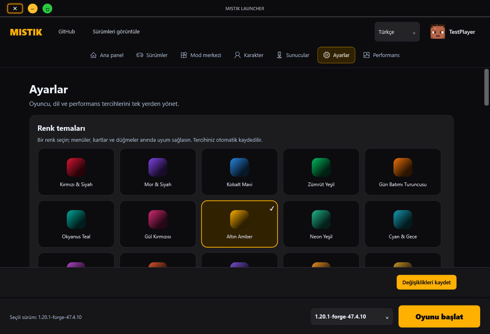
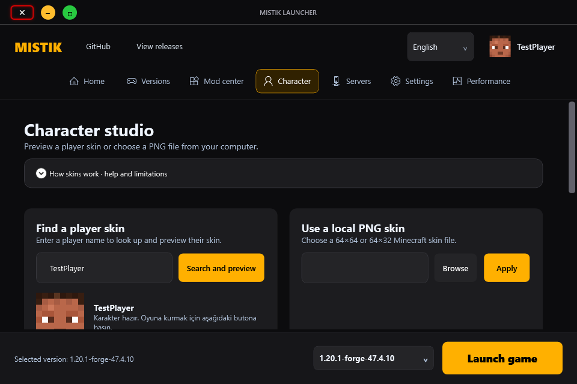
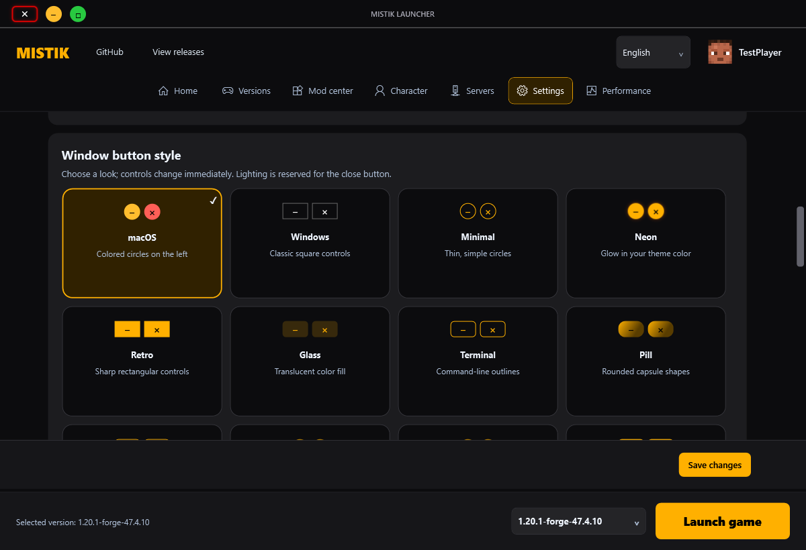

# Mistik Launcher 6.0.2 — UI and layout improvements / Arayüz ve yerleşim iyileştirmeleri

## Reasoning / Gerekçe

Compact windows exposed overlapping status text, rigid skin controls and clipped translated buttons. Cached pages could retain the previous language. Accent colors also produced insufficient contrast on secondary controls.

Dar pencerelerde durum metni, skin alanları ve çevrilen düğmeler taşabiliyordu. Önbellekteki sayfalar eski dilde kalabiliyor, bazı tema renkleri okunabilirliği azaltıyordu.

## Implementation / Uygulama

- Centered window title and rectangular close lighting; RGB follows Windows animation preferences. / Ortalı başlık, dikdörtgen çıkış ışığı ve Windows animasyon tercihlerine uyan RGB.
- Flexible bottom bar, skin fields and mod actions; 960×640 minimum layout. / Esnek alt çubuk, skin alanları ve mod işlemleri.
- Wider settings, 20 theme swatches, four-column window styles and a permanently visible save footer. Unsaved input survives language changes. / Geniş ayarlar, 20 renk, dört sütunlu pencere stilleri; kaydetme alanı görünür ve dil değişiminde taslak değerler korunur.
- Shared focus, press, selection and scroll styling; improved contrast and minimum text sizing. / Ortak odak, basma, seçim ve kaydırma stilleri; iyileştirilen kontrast ve metin boyutu.
- Turkish/English mod headings, pack descriptions, skin sections and performance headings; cached-page translation fixed. / Türkçe/İngilizce mod, skin ve performans başlıkları; önbellekteki sayfaların dil geçişi düzeltildi.
- Removed unsupported guaranteed FPS claims. / Dayanağı olmayan kesin FPS artışı iddiası kaldırıldı.

Significant files: `MainWindow.xaml`, `App.xaml`, `WindowAppearance.cs`, `Localization.cs`, `Pages/ModernPages.cs`, `Pages/SettingsAndMorePages.cs`, `Pages/VersionAndModPages.cs`, `Pages/CloudAndFriendsPages.cs`, `Locales/en.json`, `Locales/tr.json`, `Validation/Program.cs` under `MistikLauncher/` except Validation.

Examples: “Installed mods” / “Kurulu modlar”; “Character studio” / “Karakter stüdyosu”. Switch languages from the upper-right selector. / Sağ üstteki dil seçicisini kullanın.

## Validation and conclusion / Doğrulama ve sonuç

253 automated checks passed on the obfuscated package, covering theme contrast, saved drafts, cached translations, compact layout, RGB, update integrity, installation rollback and real update-helper lifecycle. WPF-rendered previews cover both languages; these do not establish exhaustive physical-monitor/DPI or gameplay coverage.

Korumalı pakette 253 otomatik kontrol geçti. İki dilde WPF görselleri üretildi; bütün fiziksel ekran/DPI ve oyun senaryoları test edilmiş değildir.

Online setup downloads and verifies the package; offline setup embeds it; ZIP is portable. Existing game data stays under `%APPDATA%\.mistik_ultra`. / Online kurulum indirip doğrular, offline kurulum dosyaları içerir, ZIP taşınabilirdir; oyun verileri korunur.

This release is unsigned. Obfuscation and SHA-256 checks do not provide trusted publisher signing. Some legacy dialogs remain Turkish and third-party Auto-MCS verification is still outstanding. / Sürüm imzasızdır; karartma ve SHA-256 yayıncı imzası değildir. Bazı eski iletişim kutuları Türkçedir; Auto-MCS doğrulaması tamamlanmamıştır.

