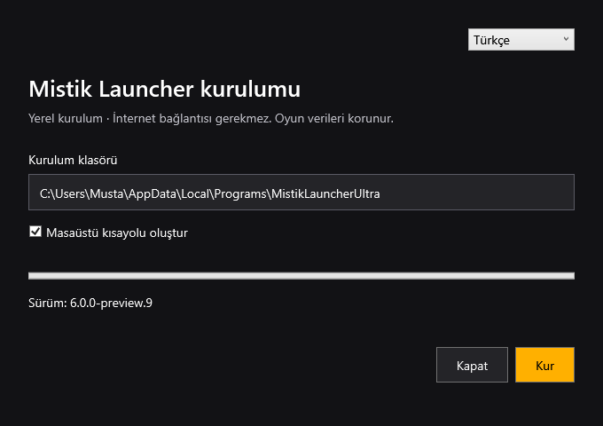
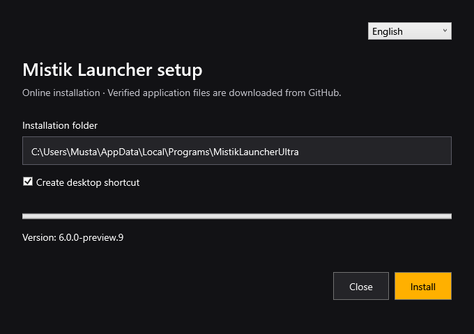

# Kurulum ve yayın / Setup and release

## Gerekçe / Reasoning

Eski kurulum belirli bir eski EXE'yi indiriyor ve bilgisayarın sertifika güvenini değiştirmeye çalışıyordu. Yeni kurulum sürümü, indirme boyutunu ve SHA-256 özetini doğrulamalı; oyun verilerini korumalı. GitHub büyük yüklemelerde hata verdiği için yalnızca yayın sırasında parçalı aktarım kullanılır.

The legacy installer downloaded an obsolete executable and attempted certificate trust changes. Setup now validates release version, size and SHA-256 while preserving game data. A staged transfer fallback handles large-upload failures during publishing.

## Uygulama / Implementation

1. Yayın sayfasından **Online** veya **Offline** kurulumunu indirin. / Download **Online** or **Offline** setup from the release.
2. Sağ üstte **Türkçe / English** seçin. / Select **Türkçe / English** at the upper right.
3. Varsayılan klasörü kullanın veya son adı `MistikLauncherUltra` olan boş klasör seçin. / Keep the default folder or choose an empty folder ending in `MistikLauncherUltra`.
4. Masaüstü kısayolu tercihini belirleyip **Kur / Install** seçin. / Set the desktop shortcut preference and select **Kur / Install**.
5. Tamamlanınca **Launcher'ı aç / Open launcher** seçin. Uygulama dili ayrıca sağ üstten değişir. / Open the launcher; application language can also be changed at the upper right.

| Konu / Item | Davranış / Behavior |
|---|---|
| Online | Bu sürümün resmi GitHub ZIP'i ve GitHub SHA-256 doğrulaması / This version's official ZIP, verified against GitHub SHA-256 |
| Offline | Gömülü tam ZIP; kurulum internet istemez / Embedded full ZIP; installation needs no internet |
| Kurulum / Installation | `%LOCALAPPDATA%\Programs\MistikLauncherUltra`, yönetici izni yok / per-user, no elevation |
| Oyun verisi / Game data | `%APPDATA%\.mistik_ultra`, korunur / preserved |
| Kaldırma / Uninstall | Windows yüklü uygulamalar; yalnızca kurulum kaydındaki dosyalar / Windows installed apps, recorded files only |
| Mevcut kurulum / Existing installation | Dolu klasöre kurulum yok; launcher güncelleyicisini kullanın veya önce kaldırın / Nonempty targets rejected; use updater or uninstall first |
| Sertifika / Certificate | Yerel test imzası, genel yayıncı güveni sağlamaz / local test signature, not publicly trusted |

### Görseller / Previews

Türkçe yerel kurulum / Turkish offline setup:

English online setup:

### Yayın bütünlüğü / Release integrity

`Build-Protected.ps1` obfuscation sonrası imzalar ve dosya manifesti üretir. `Build-Installers.ps1` iki setup EXE'sini oluşturup imzalar ve gerçek yerel EXE'de kurulum/kaldırma testi çalıştırır. `Publish-Release.ps1` doğrudan yayınlar; büyük aktarım hatalarında `Stage-LocalRelease.ps1` ve manuel `Finalize locally signed release` iş akışı kullanılabilir. Parçalar ve birleştirilmiş dosyalar SHA-256 ile doğrulanır. Uygulama dosyaları bulutta yeniden derlenmez; özel anahtar aktarılmaz. Geçici parçalar yayımdan önce kaldırılır.

Protection/signing precede manifest generation. The installer build verifies the actual offline EXE's installation/uninstallation lifecycle. Direct publishing has a staged fallback: every part and combined file must match its local SHA-256. Cloud assembly does not rebuild binaries or receive the private signing key. Temporary parts are removed before publication.

## Sonuç / Conclusion

Korumalı pakette 209 kontrol geçti. Gerçek yerel kurulum EXE'si 480 dosyayı doğruladı, ayrı test klasörüne kurdu, kendi dosyalarını kaldırdı ve test kullanıcı dosyasını korudu. İki dilde her iki sihirbaz WPF ile oluşturulup görsel olarak incelendi. İmzası değiştirilmiş EXE `HashMismatch` ile reddedildi. Genel Windows yayıncı güveni sağlanmış değildir.

209 protected-package checks passed. The actual offline setup verified 480 files, installed an isolated fixture, removed owned files and preserved a test user file. Both wizard modes were rendered and visually reviewed in Turkish and English. A modified executable returned `HashMismatch`. Public Windows publisher trust is not provided.
