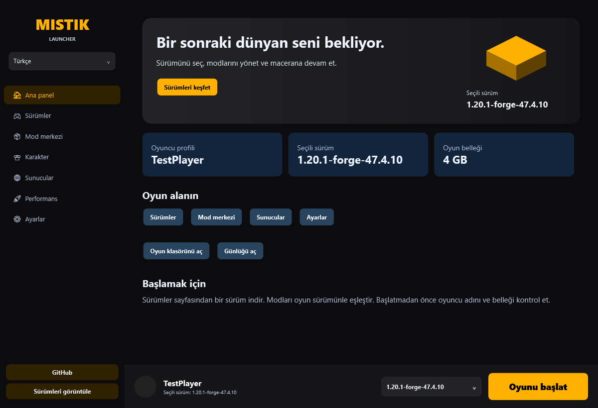
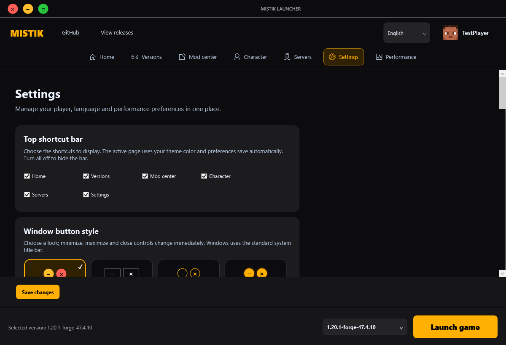

# Modernization workflow report

**Delivered: a tested protected portable preview. The original request is not fully complete.** Vanilla/Forge gameplay and an isolated server were tested; full legacy localization and broader feature checks remain outstanding. Latest seven-stage update: [PC validation, RGB fix and signing — preview.7](PC-TESTS-PREVIEW-7.md). The earlier sections below record historical results.

## Step 1 — Audit and bug fixing

- **Reasoning:** Prioritize user control and data integrity before extending a launcher that downloads and executes code.
- **Implementation:** Cloned revision `7d90ade`; installed a workspace-local .NET SDK; replaced silent installer startup; removed unauthenticated remote installation and automatic telemetry; disabled hardcoded admin access and unsigned executable replacement; normalized settings; added atomic writes/backup recovery; rejected arbitrary uninstall targets; configured MQTT TLS; removed incorrect version-name rewriting. Files: `Core.cs`, `App.xaml.cs`, `MainWindow.xaml.cs`, `ReleaseSecurity.cs`. The per-fix ledger is [AUDIT.md](AUDIT.md).
- **Conclusion:** These corrections compile and targeted tests pass. This is not a certification that every legacy bug or vulnerability has been found.

## Step 2 — Feature enhancement

- **Reasoning:** Everyday controls should be discoverable and preferences should reject invalid values before launch.
- **Implementation:** New player/version/memory overview, quick navigation, game-folder/log access, validated settings, skin-provider/accent/automatic-closing preferences and repository/release links. Global launcher search was later removed; page-local search remains. `Pages/ModernPages.cs` and `MainWindow.xaml.cs` implement these changes.
- **Conclusion:** The new controls are available in Turkish and English. Existing game downloads, mod migration, skins and server execution still require end-to-end verification.

## Step 3 — Turkish and English

- **Reasoning:** Runtime language selection must persist and must not recreate server controllers.
- **Implementation:** Embedded paired `Locales/tr.json` and `Locales/en.json`; resource loader and language event in `Localization.cs`; top navigation selector; immediate redraw of new pages; compatibility translation of catalogued legacy strings. Example `play`: **Oyunu başlat** / **Launch game**. Locale parity, nonempty translations and language persistence are tested.
- **Conclusion:** New home/settings/navigation are bilingual. The legacy translation inventory lists 236 uncatalogued helper literals at generation time, plus dynamic/XAML content that needs separate review. Full application localization is incomplete.

## Step 4 — Obfuscation

- **Reasoning:** Protect eligible release code while preserving WPF bindings and configuration interoperability; never treat reversible string hiding as secret encryption.
- **Implementation:** Pinned Obfuscar 2.2.49; private-member renaming, Unicode names and string hiding; deliberate WPF/JSON exclusions; protected validation and ZIP generation in `scripts/Build-Protected.ps1`. Private mappings and PDBs are excluded from the distributed package.
- **Conclusion:** Historical protected DLL validation passed thirteen checks and two-language renders. Current validation totals are recorded in the Preview.9 release notes. Public source remains readable; this is obfuscation, not strong encryption, and performance has not been benchmarked.

## Step 5 — Visual and UX redesign

- **Reasoning:** Make launch, navigation and preferences legible without overcrowding translated labels.
- **Implementation:** Slate-blue shell, Segoe UI, distinct welcome area, readable secondary text, scrollable settings, language/search controls, wrapped copy and keyboard/hover/disabled button feedback. Screenshot review caught and corrected a legacy template that ignored padding.
- **Conclusion:** Home/settings were rendered and reviewed in both languages. The older feature pages still need professional design/accessibility review.






These are actual off-screen WPF renders with an isolated TestPlayer configuration, not live gameplay screenshots.

## Step 6 — Repository update

- **Reasoning:** Preserve reviewable work without presenting an unfinished preview as the completed stable replacement.
- **Implementation:** Local preview changes are saved in Git. GitHub authentication and write access were verified; preview commits were pushed to `codex/modernization-preview`. A Windows build/validation workflow was added.
- **Conclusion:** The preview branch is published; stable replacement is pending completion of the remaining release requirements. Original committed binaries were not replaced.

## Step 7 — Review and documentation

- **Reasoning:** Users and maintainers need bilingual run/build guidance and an honest account of verification limits.
- **Implementation:** Replaced README with Turkish/English setup, operation, switching, build, protection and data-location instructions. Added audit ledger, remaining-language inventory, twelve-check WPF validation and reproducible packaging. Ordinary/protected tests pass; latest protected build has zero warnings/errors; NuGet reports no known vulnerable resolved dependencies.
- **Conclusion:** Documentation and the protected portable preview are available locally. See the outstanding-work list in [AUDIT.md](AUDIT.md) before a stable release.

## Güvenli GitHub girişi

Bilgisayarda Git Credential Manager 2.9.0 kurulu. PowerShell:

```powershell
git credential-manager github login --username gamer3434 --browser
```

GitHub sayfasında doğru hesabı seçin, iki aşamalı doğrulamayı ve Git Credential Manager yetkilendirmesini tamamlayın. Tarayıcı açılmazsa `--browser` yerine `--device` kullanın; geçici kodu yalnızca komutun gösterdiği GitHub sayfasına girin. Parola/tokenı sohbete göndermeyin.


## Auto-MCS follow-up

Implemented the user-requested manual update button, persisted automatic updates at launcher startup, official stable Windows release discovery, SHA-256 verification, atomic replacement and running-process deferral. Redesigned the server workspace in Turkish and English. Protected validation passes 24 checks; optional live ordinary validation passes 25, including official v2.3.9 download without execution.


## Launcher updater and modern colors

- **Reasoning:** Keep installed launcher packages current through authenticated official release metadata while preserving user data and active operations.
- **Implementation:** Added `LauncherUpdater.cs`, shared `Updater/UpdateEngine.cs`, self-contained helper, settings controls, startup/30-minute checks, verified package manifests, rollback/restart, version-matched release pipeline, unified navy/turquoise palette and bilingual cached-page fix. Current Preview.9 does not use the old cloud profile system.
- **Conclusion:** New updater and visuals are implemented; validation includes a real helper lifecycle against an isolated fixture. Stable production publication still awaits the broader outstanding work.

## Reference-driven appearance update / Referansa dayalı görünüm

**Reasoning / Gerekçe:** The supplied RedX Library screenshots establish a charcoal-and-amber palette; navigation search is unnecessary.

**Historical implementation / Tarihsel uygulama:** Removed the global navigation search controls, handler and filtering method. Added 20 bilingual gradient theme cards with selected outlines, dark selectors and contrast-aware primary text. Shared WPF brushes keep live theme changes small; no new dependencies. Version: 6.0.0-preview.2.

**Conclusion / Sonuç:** 74 checks pass in the protected package, covering all 20 themes, both languages and search removal alongside existing Forge/update checks. Screenshots: `docs/screenshots/settings-tr.png` and `settings-en.png`.

## Historical: top navigation and Firebase profiles — preview.5

**Reasoning / Gerekçe:** The user requested centered top navigation, a skin/name profile at the right, a maximized-window overlap fix and Firebase sync limited to profiles, skin preferences and settings. Public root database rules could not safely hold private profiles.

**Implementation / Uygulama:** Removed the sidebar and centered icon/label pairs in the existing configurable toolbar. Added a profile button linked to settings. All 16 window styles now share one custom caption with a maximized resize-frame inset. Added `CloudProfiles.cs`, `WindowsSecret.cs` and a bilingual account card. Reused HttpClient, existing JSON support and native Windows DPAPI; no additional client dependencies. Settings changes debounce for 1.5 seconds; startup/sign-in restores the account's cloud profile. Cancellation prevents queued uploads from preceding profile restores or surviving sign-out. Empty toolbar choices round-trip through Realtime Database. PNGs are bounded and decoded before use. Closed public root rules, deployed authenticated UID ownership and field validation to `mistiklauncher-9eb4b`, and enabled email/password Auth with anonymous sign-in disabled. Existing database records were preserved.

**Historical conclusion / Tarihsel sonuç:** The preview.5 protected portable package passed 136 checks. Protected live Firebase validation passed 143 checks, including upload/restore, encrypted restart sessions, foreign-user access denial and invalid update rejection. These cloud-enabled results do not describe current Preview.9. Details: [archived cloud profiles](CLOUD-PROFILES.md), [window and toolbar](WINDOW-AND-TOOLBAR.md).

## Error audit and protection — preview.6

**Reasoning / Gerekçe:** Inspect destructive file operations and untrusted profile/download inputs before strengthening the distributed package. Preserve existing native/library support instead of adding a new encryption framework.

**Implementation / Uygulama:** Transactional mod pools, atomic SHA-512 verified Modrinth installs with backups and preserved disabled state, safer migration, separate NeoForge recognition, advisory version heuristics, bounded metadata reads, validated encrypted sessions, validation-before-skin-replacement, safe version IDs and HTTPS skin downloads. Removed forced server authentication JVM properties. Rebuilt the DLL with existing private-name/string obfuscation; DPAPI encryption and tamper rejection were verified.

**Historical conclusion / Tarihsel sonuç:** Preview.6 protected package passed 159 checks; protected live Firebase and Modrinth verification passed 167. These counts are historical and do not describe current Preview.9. Corrections, file references and remaining limits: [preview.6 audit](AUDIT-PREVIEW-6.md).
